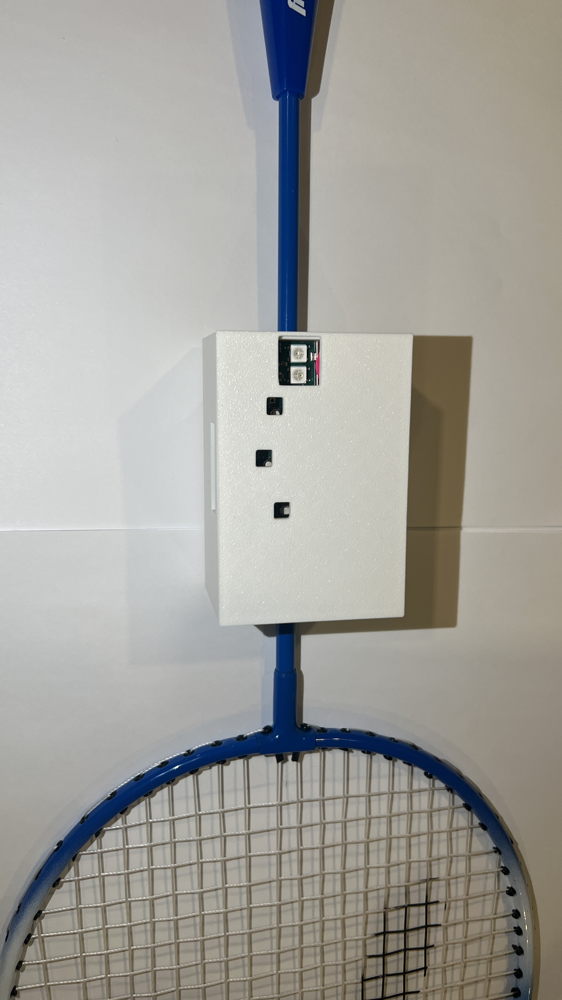
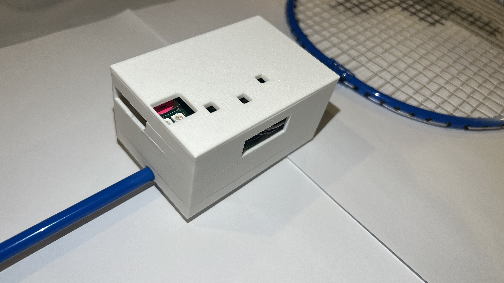

# a14g-final-submission

    * Team Number: 31
    * Team Name: Solo
    * Team Members: Yuhe Zhang, Zihao Cai
    * Github Repository URL: https://github.com/ese5160/a14g-final-submission-s25-t31-solo
    * Description of test hardware: (development boards, sensors, actuators, laptop + OS, etc) 

## 1. Video Presentation
https://drive.google.com/file/d/13gdHr8eEfZFXVztwB7vjUEcWh-SdYJhg/view?usp=drive_link
## 2. Project Summary
### Device Description
This project is a smart badminton training device embedded in the racket. It automatically counts swings and detects successful hits using onboard motion sensors, and light up a LED and sound a buzzer for each succefful hit to give a boost to users. 
The project was inspired by the difficulty of tracking training progress during solo badminton practice. By integrating real-time motion and impact detection, the device provides precise feedback and motivation.
While the embedded features work locally, the system also connects to the Internet via the SAMW25 to report metrics to a Node-RED dashboard, enabling visualization and remote monitoring.
### Device Functionality 
The system is based on the SAMW25 Xplained Pro board running FreeRTOS, and uses an MPU6050 IMU to detect swing and impact events.
Each time a hit is detected, the system lights up a color-coded RGB LED (indicating training vs. competition mode) and triggers a buzzer beep. Two buttons allow the user to toggle between modes and start/stop a session.
All hit data is sent over Wi-Fi to a Node-RED dashboard, where progress can be visualized in real-time.

System Components:
MPU6000: Detects swing and hit using accelerometer + gyro

SAMW25: Hosts all firmware, Wi-Fi communication, and task scheduling

RGB LED: Indicates mode and feedback

Buzzer: Audio feedback for confirmed hits

2 Buttons: User input for control

### Challenges 
The largest challenge was the PCB is a very rough one, with multiple failures on serial communication, SD card recognition, I2C communication and buck, boost converters. Plus a desgin issue of our sensors, it was a very tough progress. We shifted to the SAMW25 xplained board and redesigned the control flow to make the demo robust.
Another major challenge was reliable hit detection with noisy IMU data. Initially, small vibrations falsely triggered events. This was solved by adding thresholds, timing gates, and smoothing logic.

### Prototype Learnings
We learned how to filter real-time sensor signals and handle asynchronous events using FreeRTOS queues.
Next time, we would prioritize modular PCB design, better enclosure planning, and early debugging of sensor alignment, also, probably pick a better manufacturing company.

### Next Steps & Takeaways
The next step would be to better implement over-the-air firmware updates (OTAU) so it is more robust, and add an OLED display for local status.
Through this project and ESE5160, we gained deep experience in embedded systems, RTOS design, and wireless integration with cloud dashboards.

### Project Links
Node-Red Dashboard: http://172.208.29.201:1880/ui/#!/1?socketid=Xp3XAJFOKK1CsBg-AACH
Altium PCB link: https://upenn-eselabs.365.altium.com/designs/D12EB9F7-FE5B-483B-BA67-F4D2DDD64F86

## 3. Hardware & Software Requirements
### Hardware Requirements
The system is built on the SAMW25 Xplained Pro board, which combines an Atmel SAMD21 microcontroller with a WINC1500 Wi-Fi module. It handles real-time sensor processing, FreeRTOS task scheduling, and cloud communication.

Motion sensing relies on the MPU6000 IMU, featuring a 3-axis accelerometer and gyroscope. Connected via I2C, it detects swings and hits based on angular velocity and acceleration changes.

For user feedback, the system includes an RGB LED (with 220Ω resistors) to indicate modes and events, and a piezo buzzer (AST-02308MR-R) to signal successful hits. The buzzer is driven via a 2N3904 transistor controlled by PWM output on PA10.

Two push buttons allow the user to toggle modes and start/stop sessions. They use internal pull-ups and debounce logic to avoid false triggers.

All components are connected on a breadboard, and the system is powered via USB (3.3V through the SAMW25 board).
### Software Requirements
The project runs on FreeRTOS, with tasks including ControlTask, SensorTask, ButtonTask, LedTask, and BuzzerTask. Each task handles specific functions for modularity and timing control.

Peripherals are managed using ASF4 drivers for GPIO, I2C, and PWM (TCC). A custom I2C driver and mpu6000.c/h module process sensor data for swing and hit detection.

The LED and buzzer are triggered via FreeRTOS queues based on motion events. Sensor filtering and timing windows improve accuracy and reduce false detections.

The system connects to Wi-Fi and streams hit data and session status to a Node-RED dashboard for real-time monitoring.

Development was done in Microchip Studio, with serial debug via Tera Term. Although initially intended for a custom PCB (Altium Designer), the final demo used the SAMW25 board due to hardware damage, with pin mappings updated accordingly.

### Validation & Testing
To ensure each hardware component functioned as intended, we conducted isolated and integrated testing throughout the development process.

The MPU6000 IMU sensor was first verified using a dedicated who_am_i register read test, confirming a stable I2C connection (returning 0x68). We then implemented a test loop that printed raw accelerometer and gyroscope readings to the serial console. Through repeated motion trials (swinging and striking the racket), we tuned thresholds and added debounce logic in software to distinguish between casual movement and intentional hits. To validate the effectiveness of hit detection, we printed Hit detected messages in the control task and observed accurate counts aligned with physical impacts. Additionally, we introduced debug printouts for both swing and hit events to further confirm classification correctness.

The buzzer subsystem, driven by a 2N3904 transistor controlled via PWM (TCC1 on PA10), was tested by toggling PWM output in isolation. Initially, the buzzer remained continuously on due to missing stop logic. After restructuring the buzzer task to auto-disable the PWM signal after a 200ms delay, the buzzer behavior became consistent and reliable. We further tested its response under various session conditions and confirmed it only triggered upon valid hit events as commanded via the FreeRTOS queue.

For the RGB LED, three GPIO pins (PA16, PA17, PA18) were connected through 220Ω resistors to individual red, green, and blue LED channels. We confirmed each LED channel worked independently by running a test sequence that cycled through red, green, and blue states. In the integrated system, the LED correctly reflected the current mode (green in training, blue in competition) and also blinked red upon session transitions and end conditions. Debug printouts in the LED task confirmed it received correct structured commands over the queue, and oscilloscope tests confirmed the GPIO output behavior matched expectations.

Each of these components was validated both individually and in system context, ensuring that the system accurately captured motion data, responded with visual and audio feedback, and maintained task-level synchronization under FreeRTOS.

## 4. Project Photos & Screenshots

## Codebase

- A link to your final embedded C firmware codebases:
  https://github.com/ese5160/final-project-t31-solo
- A link to your Node-RED dashboard code: http://172.208.29.201:1880/#flow/a3f65f77a8a06324

